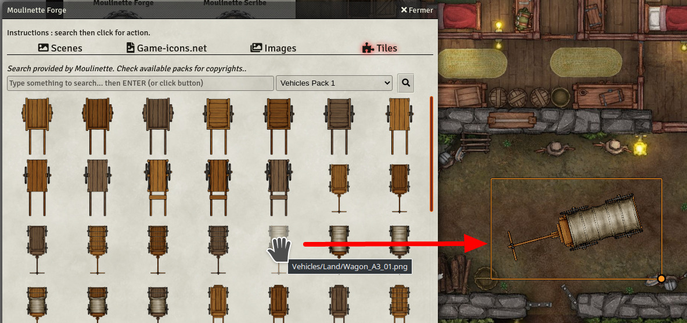
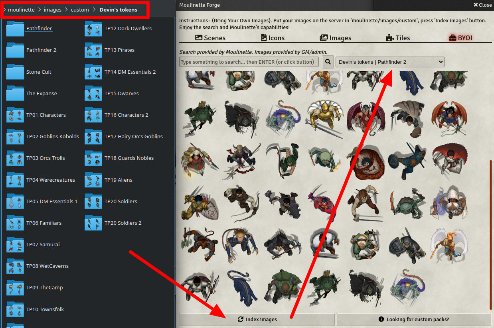

# Moulinette Forge Tiles (Foundry VTT)

This is a submodule for [Moulinette Core](https://github.com/SvenWerlen/moulinette-core). See [Moulinette Core](https://github.com/SvenWerlen/moulinette-core) for an overview of all modules.

## Download and install tiles

You want to add tiles on your maps?
* Search using Moulinette engine
* See publisher and license (generally [CC BY-NC-SA 4.0](https://creativecommons.org/licenses/by-nc-sa/4.0))
* Drag and drop tiles 
* Voilà!

 _(Tiles on the screenshot are from [Forgotten Adventures](https://www.forgotten-adventures.net/) which are license under [Attribution-NonCommercial-ShareAlike 4.0 International (CC BY-NC-SA 4.0)](https://creativecommons.org/licenses/by-nc-sa/4.0/))_

## Bring your own tiles

You created or downloaded some tokens/assets you'd like Moulinette to manage for you?
* Put them in `moulinette/images/custom` folder.
* Make sure to have at least a 2-depth structure (1. Publisher, 2. Pack, 3+ Images)
* Index images
* Moulinette provides you now the same features as for tiles (see above)

 _(Tokens on the screenshot have been downloaded from [Devin's Token Site](https://immortalnights.com/tokens/token-packs/). 20 token packs have been made free to the public.)_

## <a name="install"/>Install the module

To **install** the module from FoundryVTT:
1. Start FVTT and browse to the Game Modules tab in the Configuration and Setup menu
2. Search for "Moulinette Forge" and click install on the desired module

To **manually install** the module (not recommended), follow these instructions:

1. Start FVTT and browse to the Game Modules tab in the Configuration and Setup menu
2. Select the Install Module button and enter the following URL: https://raw.githubusercontent.com/svenwerlen/moulinette-tiles/master/module.json
3. Click Install and wait for installation to complete 

## <a name="support"/>Support me on Patreon

If you like my work and want to support me, consider becoming a patreon!

[https://www.patreon.com/moulinette](https://www.patreon.com/moulinette)

You can also join [Moulinette Discord](https://discord.gg/xg3dcMQfP2)
